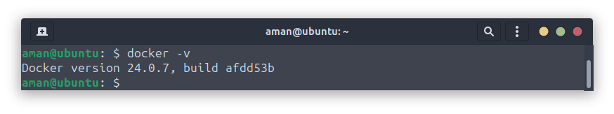
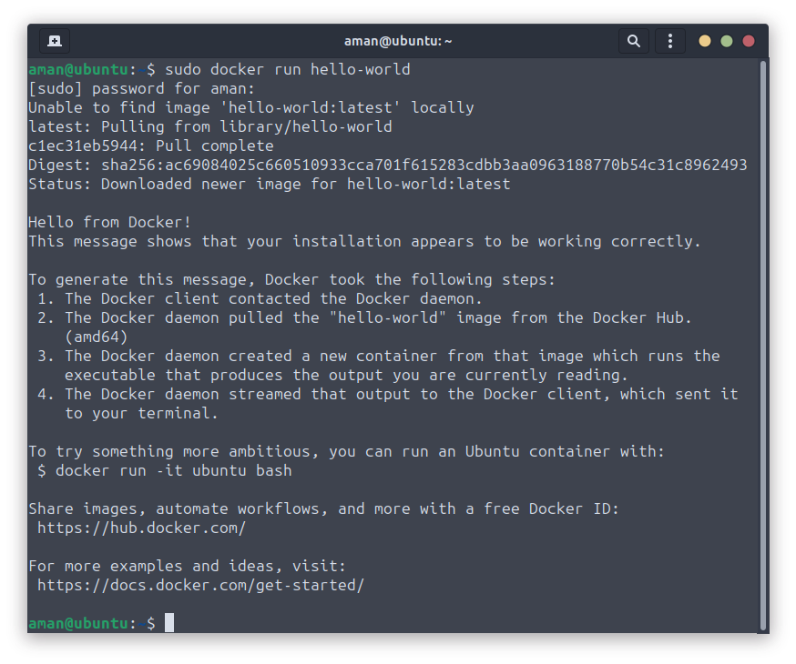
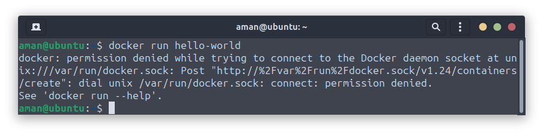
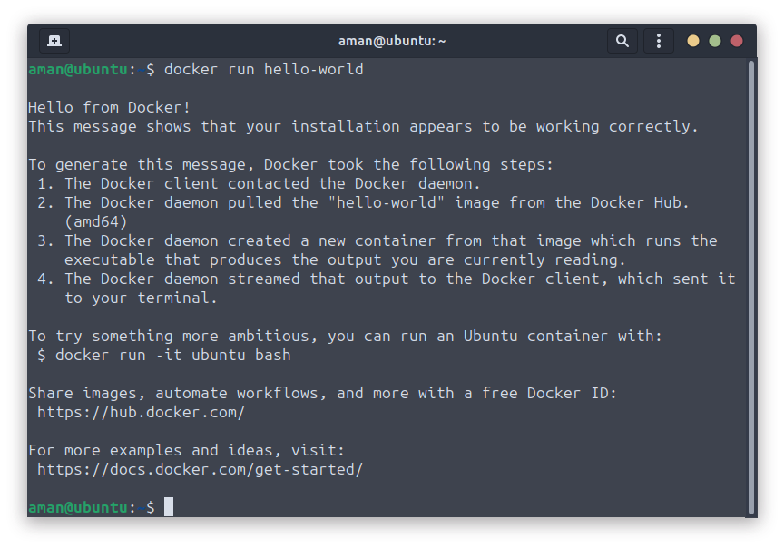

# **How to Install Docker on Ubuntu**

There are two recommended ways of installing Docker on Ubuntu:

- **Installing Docker from Ubuntu's repository**: Easy, single line command but gives a little old version
- **Using Docker's official repository**: Slightly more work but gives the most recent stable release

<br />

## **Method 1: Install Docker using Ubuntu's repository**

If you don't care about having a little older version and don't want to get into setting and managing repositories, then this is the best method for you.

Start with updating the repository index:
```bash
sudo apt update 
```
Now, you can use the following command to install Docker as well as Docker Compose in Ubuntu:

```bash
sudo apt install docker.io docker-compose
```
>📋
The Docker package is named docker.io because there existed a transitional package named docker (for docklet applications) even before Docker came into existence. For this reason, the Docker package had to be named something else.

Once you are done with the installation, you can check the installed version using the following command:

```bash
docker -v
```

<br/>

## **Method 2: Install the latest stable version of Docker in Ubuntu**

If you want the most recent stable version of Docker, then you can install Docker from their official repository.


### **Step 1: Remove any existing Docker packages**

But before you jump to the installation part, it is necessary to remove any old installation of Docker.

To uninstall the old Docker installation, use the following command.
```bash
sudo apt remove docker.io docker-doc docker-compose docker-compose-v2 podman-docker containerd runc
```

### **Step 2: Install dependencies**

The first step is to install some essential packages which will be used to install Docker later in this tutorial:
```bash
sudo apt install ca-certificates curl gnupg lsb-release
```
You may already have some or all of these packages installed but no harm in ensuring that. The above command won't harm you.


### **Step 3: Add GPG key of Docker repository and add it to sources.list**

Now, create a directory with special permissions suitable for storing cryptographic keyrings by the apt package manager for package verification:
```bash
sudo install -m 0755 -d /etc/apt/keyrings
```
Next, use the curl command as shown below to download and import GPG keyring for Docker:
```bash
curl -fsSL https://download.docker.com/linux/ubuntu/gpg | sudo gpg --dearmor -o /etc/apt/keyrings/docker.gpg
```
After downloading the GPG keyring, change the file permissions using the chmod command so every user on the system can read the GPG keyring:
```bash
sudo chmod a+r /etc/apt/keyrings/docker.gpg
```
Finally, add the Docker repository to the `sources.list.d` file:
```bash
echo \
  "deb [arch=$(dpkg --print-architecture) signed-by=/etc/apt/keyrings/docker.gpg] https://download.docker.com/linux/ubuntu \
  $(. /etc/os-release && echo "$VERSION_CODENAME") stable" | \
  sudo tee /etc/apt/sources.list.d/docker.list > /dev/null
```

That's it!


### **Step 4: Installing Docker and Docker Compose**

Now, to take effect from the changes you've made to the system, update the system repository:
```bash
sudo apt update
```
Grab the latest version of Docker along with other Docker components and dependencies using the following command:
```bash
sudo apt install docker-ce docker-ce-cli containerd.io docker-buildx-plugin docker-compose-plugin
```

>📋
While the docker.io package installs most of the necessary Docker components, you'll need to do it individually here.

To check the installed version, use the following command:
```bash
docker -v
```




<br/>

## **Use a hello-world image to verify the Docker installation**

Running a Hello World program is a standard practice that we all follow to kick-start any programming journey and the same goes for Docker.

Docker provides you with a Hello World image that you can use to test the installation.

To install and run the Hello World image, simply use the following:
```bash
sudo docker run hello-world
```


Some users may get an error while executing the above command saying "Cannot connect to the Docker daemon":
```bash
docker: Cannot connect to the Docker daemon at unix:///var/run/docker.sock. Is the docker daemon running?
```
In that case, reboot your system and try again to install the Docker Hello World image and it'll work just fine.

<br/>

## **💡Bonus Tip: Use docker without sudo in Ubuntu**

If you noticed, I used sudo to pull the docker image which is not the most convenient way to use the Docker.

If you try to use Docker without sudo, it will give you an error:



Well, in this section, I will show you how you can use Docker without sudo.

>📋
To perform the shown steps, superuser privileges are a must!

The first step is to create a new group named `Docker` using the following:
```bash
sudo groupadd docker
```
Once done, add the user to the Docker group using the following:
```bash
sudo usermod -aG docker <username>
```
>🚧
Make sure you only mention the user who has super-user privileges.

Now, log out and log back in to take effect from the changes. But if you are using a VM then reboot is a must.

That's it! From now on, you can use the docker commands without sudo like I did to run the Docker Hello World image:


There you go.