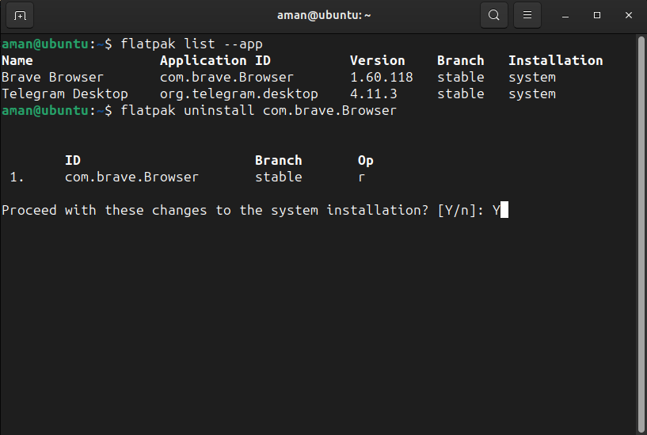
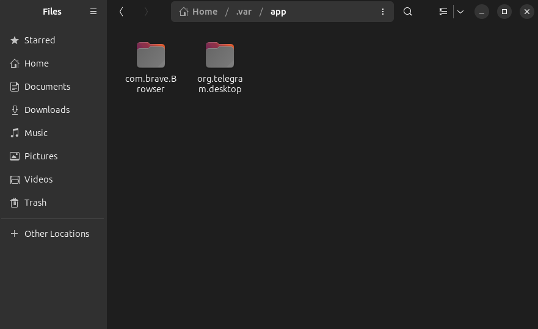

# Table of Contents

[1. Introduction](#introduction)<br/>
[2. Installation](#installation)<br/>
[3. Uninstallation](#unistallation)<br/>
[4. Summary](#summary)

## Introduction

## Installation

### Install Flatpak

To install Flatpak on Ubuntu 18.10 (Cosmic Cuttlefish) or later, simply run:

```bash
sudo apt install flatpak
```       
    
With older Ubuntu versions, the official Flatpak PPA is the recommended way to install Flatpak. To install it, run the following in a terminal:

```bash
sudo add-apt-repository ppa:flatpak/stable
sudo apt update
sudo apt install flatpak       
```

### Install the Software Flatpak plugin

The Flatpak plugin for the Software app makes it possible to install apps without needing the command line. To install, run:

```bash
sudo apt install gnome-software-plugin-flatpak       
```

Note: the Software app is distributed as a Snap since Ubuntu 20.04 and does not support graphical installation of Flatpak apps. Installing the Flatpak plugin will also install a deb version of Software and result in two Software apps being installed at the same time.

### Add the Flathub repository

Flathub is the best place to get Flatpak apps. To enable it, run:

```bash
flatpak remote-add --if-not-exists flathub https://dl.flathub.org/repo/flathub.flatpakrepo       
```

### Restart

To complete setup, restart your system. Now all you have to do is [install some apps](https://flathub.org/)!

<br>

## Unistallation

### 1. Remove a flatpak app, Clean app data and unused runtime libraries

As you may know, it’s easy to remove a flatpak app via the command below in terminal:
```bash
flatpak uninstall App-ID
```
You may firstly list all available apps as well as their **ID** via command:
```bash
flatpak list --app
```
Then you can paste an **app ID** after `flatpak uninstall` command to remove it. For example, the command in the picture will remove “Brave Browser” from my system.



### a. Purge personal app data

Some applications store their app data in user’s personal folders. Normally remove command will NOT delete these data files, so it takes more and more disk space after installing & using flatpak apps for a long period of time.



The **.var** is a hidden folder, you need to press `Ctrl+H` in file manager to show / hide it. And select remove the data folders if the apps are already removed. Or add `--delete-data` to get rid of them when trying to remove an app.

For instance, remove "Brave Browser" as well as the personal data via command:

```bash
flatpak uninstall --delete-data com.brave.Browser
```
### b. Remove un-used runtime libraries

While installing an app, you may found that it tries to install some packages, e.g., Gnome platform, Locale, Themes, etc.

They are runtime libraries required by installed apps. And you can list all available run-times via command:

```bash
flatpak list --runtime
```

So far, Flatpak keeps installing newer runtime libraries but will NOT remove old un-used ones. Linux Mint 20.2 has updated with feature to auto-remove un-used runtime. However, other Linux need to run the command below regularly to clear unused libraries:

```bash
flatpak uninstall --unused
```

### 2. Completely remove Flatpak Apps from your system

More and more applications produce Linux packages via Flatpak. But if you intend to remove it completely from your system, do steps below.

Remove all installed flatpak apps, runtime libraries, as well as delete all app data via command:

```bash
flatpak uninstall --all --delete-data
```

After that, you’ll have to clean `.var/apps`, `.local/share/flatpak`, and `/var/lib/flatpak` directories.

However, a broken package may prevent the un-installation process, which can be fixed via command:

```bash
sudo flatpak repair
```

You can even remove the Flatpak daemon, though it’s not recommended in some Linux (e.g., Fedora Gnome Software requires it). For example, Ubuntu uses can remove it via command:

```bash
sudo apt remove --autoremove flatpak
```

## Summary

In short, you can remove a flatpak app as well as delete the app data via `flatpak uninstall --delete-date App-ID`. Run `flatpak uninstall --unused` regularly to clean up old run-time libraries for non Linux Mint users. And remove all flatpak apps and clean disk spaces via `flatpak uninstall --all --delete-data` command.